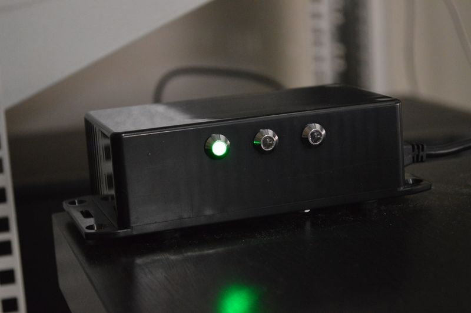

## Source code for project: [Lync presence (busy) light](https://www.uctrl.org/arduino-lync-status-light/)

Let your coworkers know your availability with this simple Arduino Uno project. Three LEDs that reflect your Lync status.

Lync bridge: https://github.com/thomasjsn/Lync-presence-bridge

### Author
[Thomas Jensen](https://www.uctrl.org/)
